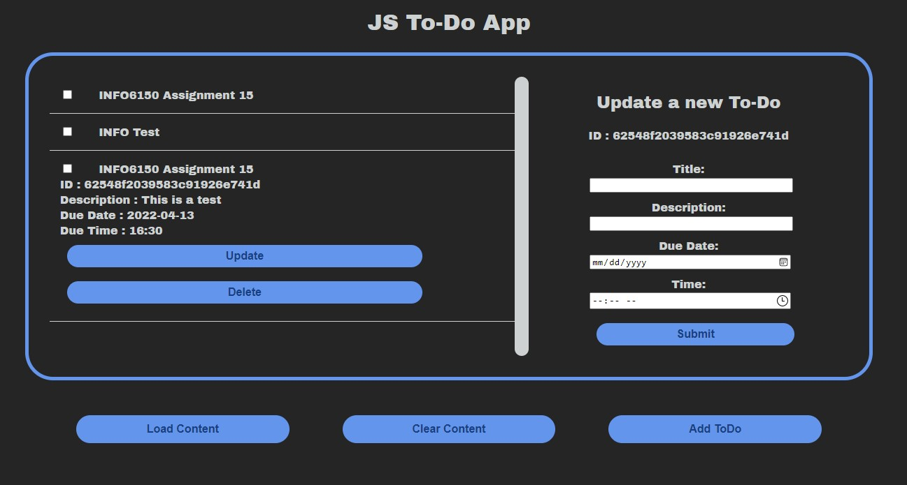

# INFO 6150 - Web and UX

## Assignment 9  - Reactjs Todo app

Create a simple Todo react application using the REST APIs from Assignment 8. 

### Instruction to Run
1. Clone the repository
2. Install backend node modules (Navigate to server/): `npm i`
2. Install frontend node modules (Navigate to todo/): `npm i`
3. Run the node server (Navigate to server/): `npm run start`
4. Run the react server (Navigate to todo/): `npm start`

### User Requirements
1. As a user, I should be able to see all to-do items fetched using a REST API.
2. As a user, I should be able to click a to-do item and able to see its detailed view.
3. As a user, I should be able to open add a new to-do item view by clicking the add button.
4. As a user, I should be able to add a to-do item by entering the title, description, due date, and time.
5. As a user, I should be able to mark a to-do item as complete.

### Technical Requirements
1. The goal of this assignment is to learn about Reactjs.
2. Use fetch API to fetch data from the Nodejs server from assignment 7.
3. You should use SCSS for CSS.
4. You should use create-react-app for building the project.
5. No JavaScript libraries should be used for this assignment.

### Grading:
1. Code documentation. (10 Points).
2. .gitignore, README.md, and multiple Git commits (10 Points)
3. Your UI should be composed of multiple components. (10 Points)
4. Assignment completion. (70 Points)

### React UI:

